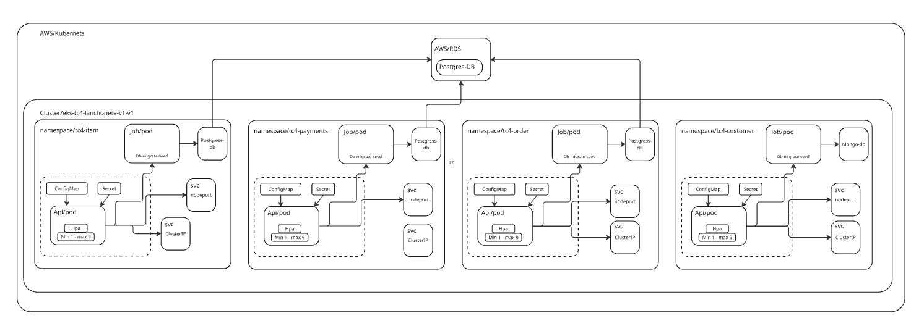
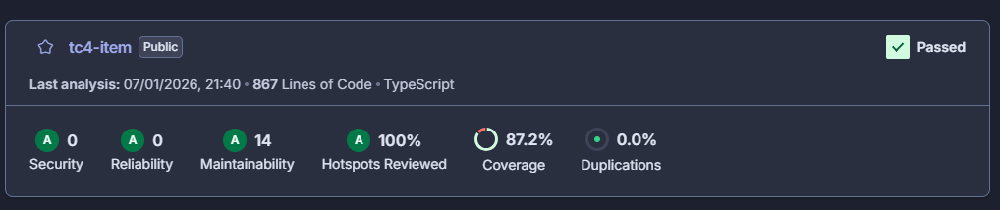
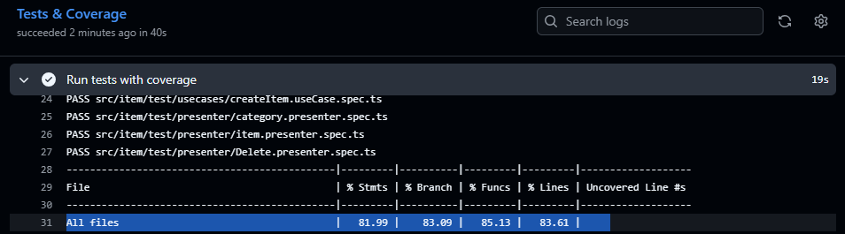

# 🍔 Micro Serviço de Item | Sistema de Controle de Pedidos 

> **Tech Challenge FIAP - Fase 04 **


## 📚 Recursos


- [Collection Postman]() 
- [Event Storming: Miro Board](https://miro.com/app/board/uXjVIFyKlHg=/) 
- [BDD - Especificação de Comportamento da Entidade Item](src/item/test/entities/item.entity.feature) 

### 

## 📋 Sumário

- [Objetivo](#-objetivo)
- [Funcionalidades](#-funcionalidades)
- [Tecnologias](#️-tecnologias)
- [Arquitetura](#️-arquitetura)
- [Linguagem Ubíqua](#-linguagem-ubíqua)
- [Desenho de requisitos do negócio](#️-requisitos-negócio)
- [Desenho da infraestrutura](#️-requisitos-infra)
- [Configuração](#️-configuração)
- [Execução](#️-execução)
- [Order de Execução](#️-ordem-execução)
- [Testes](#-testes)
- [Equipe](#-equipe)

---

## 🎯 Objetivo


---

## 🚀 Funcionalidades

### Gestão de Itens
- ✅ CRUD completo de itens
- ✅ Busca por categoria (Sandwich, Beverage, Side, Dessert)
- ✅ Controle de estoque básico


---

## 🛠️ Tecnologias

| Categoria | Tecnologia | Versão |
|-----------|------------|--------|
| **Linguagem** | TypeScript | 4.1.3 |
| **Framework** | NestJS | 10.8.2 |
| **Runtime** | Node.js | 22.0.0 |
| **ORM** | Prisma | 6.8.2 |
| **Banco de Dados** | PostgreSQL |  14.18  |
| **Containerização** | Docker & Docker Compose | Latest |

---

## 🏗️ Arquitetura
O sistema foi desenvolvido seguindo a *arquitetura limpa*, com uma estrutura modular

- Controller: Camada responsável por receber as requisições externas (HTTP, por exemplo), orquestrar a entrada dos dados e encaminhá-los para os casos de uso apropriados.

- Domain: Contém as entidades centrais do domínio, Essa camada representa a regra de negócio pura e está isolada de detalhes de infraestrutura, promovendo baixo acoplamento e alta coesão.

- UseCases: Implementa os casos de uso da aplicação, coordenando as entidades e serviços necessários para atender as regras de negócio. É a ponte entre a entrada de dados (Controller) e as regras de domínio.

- Gateways: Implementa as interfaces de saída , como acesso a banco de dados, serviços externos, promovendo a inversão de dependência.

- Infrastructure: Contém as configurações e implementações concretas de tecnologias utilizadas, como clientes HTTP, repositórios com ORM, bancos de dados .

- Presenter: Responsável por formatar a saída dos dados para os consumidores, separando a lógica de apresentação da lógica de negócio.


### Princípios Arquiteturais
- **Clean Architecture** 
- **Domain Driven Design** (DDD)

---

## 📖 Linguagem Ubíqua

### Entidades Principais

| Termo | Definição |
|-------|-----------|
| **Item** | Produto individual disponível no cardápio |

### Status e Categorias

#### ItemCategory
- `SANDWICH` - Sanduíches
- `BEVERAGE` - Bebidas
- `SIDE` - Acompanhamentos
- `DESSERT` - Sobremesas

---

## Desenho de requisitos do negócio


## Desenho da infraestrutura



## Desenho do Banco de dados 


([Documentação do Banco de dados]())


## Pré-requisitos

- **Docker** e **Docker Compose** instalados ([Guia de instalação](https://docs.docker.com/get-started/get-docker/))
- **Git** para clonar o repositório

## ⚙️ Configuração
### Clonar Repositório do projeto
```bash
# 1. Clonar o repositório

```
### Variáveis de Ambiente

```bash
# Copiar arquivo de exemplo
cp .env.example .env
```

Popular as seguintes variáveis do arquivo `.env` para utilizar setup local:

```env
DATABASE_URL=
DB_USER=
DB_PASSWORD= 
DB_NAME= 


```

## Opção 1: Setup Completo com Docker (Recomendado)

```bash
# 1. Subir todos os serviços
docker-compose up
```

## Opção 2: Setup Local (Desenvolvimento)

```bash
# 1.Instalar dependências
npm install

# 3. Subir apenas o banco de dados
docker-compose up db -d
```

---


### Setup do Banco de Dados

```bash
# Executar migrações e popular dados iniciais
npx prisma migrate dev --name init
npm run seed
```

---


## ▶️ Execução

### Desenvolvimento
```bash
npm run start:dev
```

### Acesso à Aplicação
- **API:** http://localhost:3000
- **Swagger:** http://localhost:3000/api

## 🧪 Testes

```bash
# Executar todos os testes
npm run test
```
Cobertura acima de 70% no Sonar


Cobertura acima de 80% no projeto


---

## 👥 Equipe

| Nome | RM |
|------|-----|
| **Daniela Rêgo Lima de Queiroz** | RM361289 |
| **Diana Bianca Santos Rodrigues** | RM361570 |
| **Felipe Alves Teixeira** | RM362585 |
| **Luiz Manoel Resplande Oliveira** | RM363920 |
| **Thaís Lima de Oliveira Nobre** | RM362744 |

---

## 📝 Licença

Este projeto foi desenvolvido como parte do Tech Challenge da FIAP - Pós-graduação em Software Architecture.

